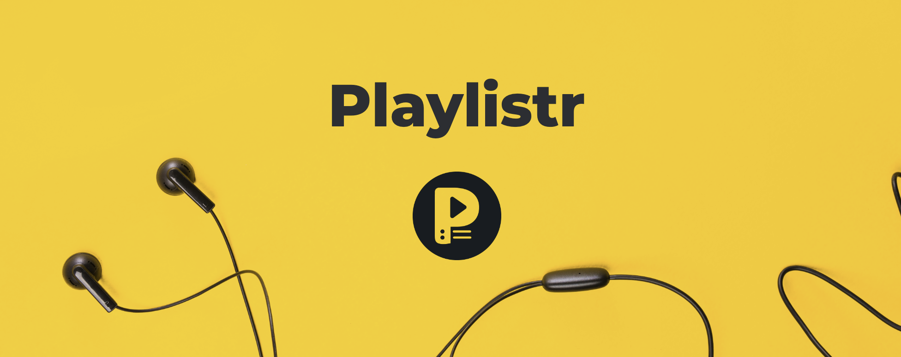
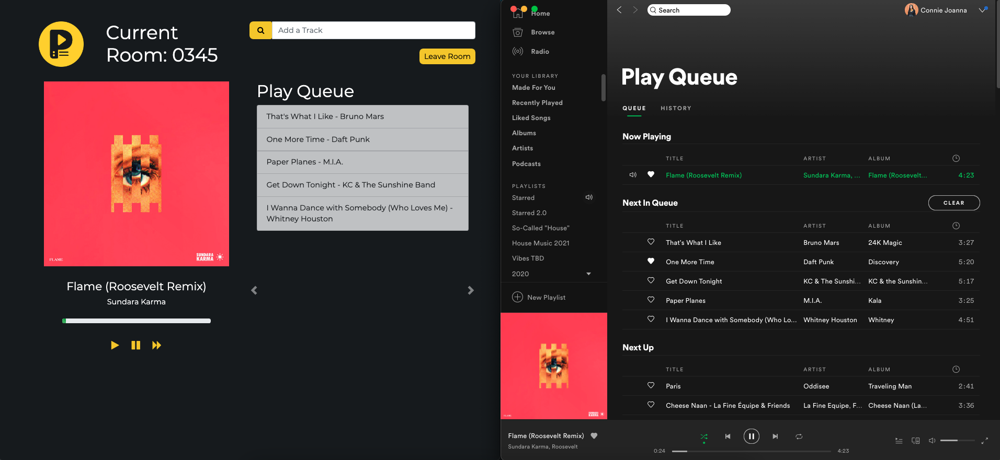
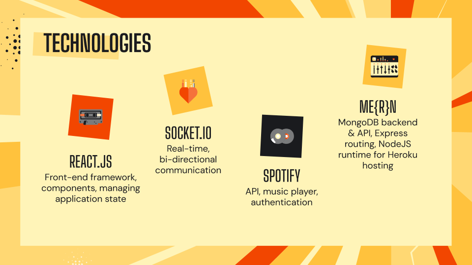
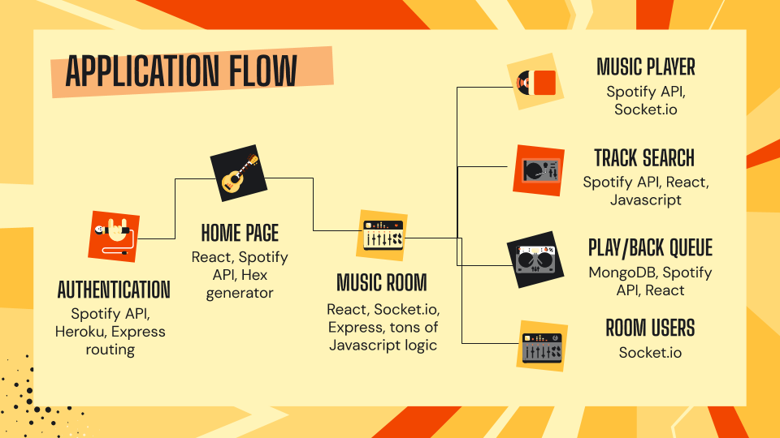
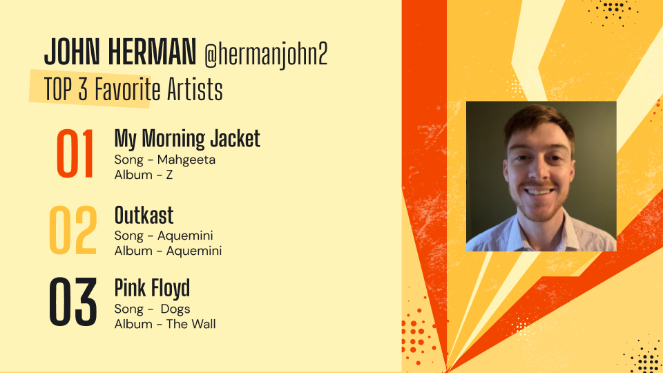
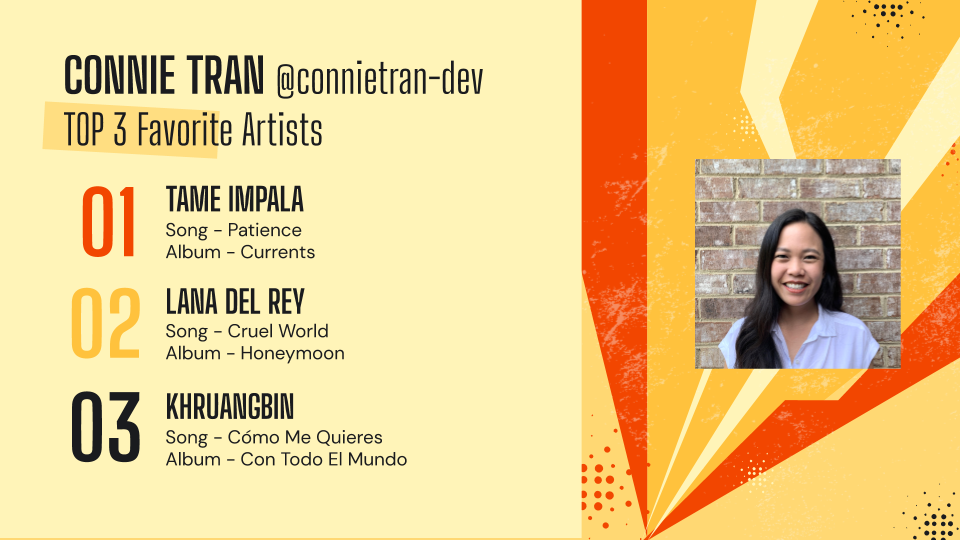

# Playlistr

    

## Description

**Playlistr** is an app for live, group music listening on Spotify. 

Build a queue of songs with friends, listen to the queue of tracks together, and control the music for the entire room - all in real-time.

    
    </a>

Playlistr is built with React, socket.io, Node, Express and MongoDB to give users the real-time ability to add tracks to a shared queue and the ability to play, pause, & skip to the next track.

After signing in with your Spotify Premium account, you can create a room to listen to music with friends. Then queue up one of your Spotify playlists or search Spotify to add new tracks for the entire room. 

Once your friends join, everyone can add tracks to a shared queue and listen to the same songs. You and your friends can play the song, pause the song, or skip to the next song for everyone in the room - all in real-time.

**Check out a walkthrough demo of Playlistr here:** https://youtu.be/4XF5diFnSIc

  

## Join Playlistr

To participate, sign in with your Spotify Premium account, and check out Playlistr here: 

https://playlistr-io.herokuapp.com

You can create a room and queue up songs from one of your Spotify playlists. Or you can search Spotify to search for songs to add to your shared queue. You can then use Playlistr to control the music while listening on Spotify.

Invite friends to listen in your room together by sharing your room code and see the real-time magic happen. 

## Table of Contents

* [Technologies](#technologies)
* [Methodology](#methodology)
* [The Team](#the-team)
* [Credits](#credits)

## Technologies

Playlistr was built using the following technologies:

* [ReactJS](https://reactjs.org/) - Front-end framework
* [socket.io](https://socket.io/) - Real-time events communication 
* [NodeJS](https://nodejs.org/en/) - Javascript runtime environment for the application
* [Express](https://expressjs.com/) - Middleware for routing HTTP requests
* [MongoDB](https://www.mongodb.com/) Atlas / Mongoose - Backend database
* [Heroku](https://www.heroku.com/) - Application and database hosting
* [Spotify API](https://developer.spotify.com/) - Music listening & playback control

## Methodology

Music was at the core of our application. It was important for us to develop MVP features, especially, real-time listening and control of music. Our Trello board contains our Backlog of features for the future of Playlistr: https://trello.com/b/FRMkIUAs/playlistr

Feel free to submit any features you'd like to see via the Issues section of this GitHub repo.

## The Team

* John Herman, [@hermanjohn2](https://github.com/hermanjohn2)
* Connie Tran, [@connietran-dev](https://github.com/connietran-dev)

    
    

To find out more about the inspiration behind this project and some frequently asked questions, check out our pitch deck here: [Playlistr Pitch Deck](https://drive.google.com/file/d/1nG980MIZ5lKGJ5p5CUeHgqalULPHr56s/view?usp=sharing)  

### Credits

* https://www.npmjs.com/package/express
* https://www.npmjs.com/package/dotenv
* https://www.freepik.com - Background image
* https://www.flaticon.com - Avatar images
* https://unsplash.com - Banner images
* https://slidesgo.com/ - Pitch deck

Copyright (c) [2021] [John Herman, Connie Tran]
